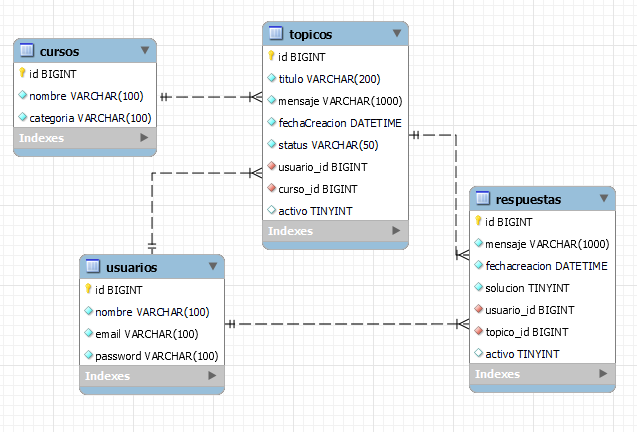

# Challenge ONE | Back End | Foro Alura

     

<H3 style="text-align: center">☕ ¡Bienvenido al desafío Foro Alura con Java y Spring! </H3>

## 🚧 Descripción del proyecto

Se crea una API Rest con la necesidad de simular el comportamiento de un foro, 
donde se relacionan tópicos con sus respetivas respuestas teniendo en cuenta 
validaciones definidas en la lógica del negocio. Para pruebas del api se utiliza Postman.

## 🖥️ Tecnologías utilizadas:

- [IntelliJ](https://www.jetbrains.com/idea/)
- [MySql](https://www.mysql.com/)
- [Java](https://www.java.com/en/)
- [Maven](https://maven.apache.org/)
- [Spring boot](https://spring.io/projects/spring-boot)
- [Token JWT](https://jwt.io/) falta implementar

## 📊 Modelo Relacional

Modelo importado desde workbench.

## 📝 Pruebas con Postman

## 🔀 Redes

🧡 <strong>Oracle</strong> 

💙 <strong>Alura Latam</strong> 

⭐ <strong>Jesus Monroy</strong> 
